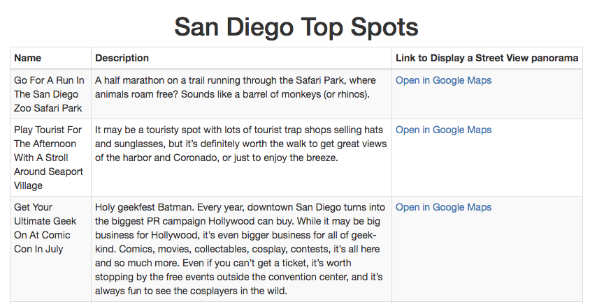

# San Diego Top Spots
>  Turns the provided JSON file into a table in HTML with links to Google Maps using jQuery.

This was my third project at Origin Code Academy. San Diego Top Spots was created using HTML, CSS, Bootstrap, jQuery, and JavaScript.



## Approach

I took a mobile first approach with this project (as I try to do with all projects, when feasible!) and thus I wanted the design to be minimal with the focus on the functionality of this app.

## Installation

Download all associated files and load them up in your favorite text editor!

## Development setup

This app relies on jQuery and Javascript for its functionality and HTML, CSS, and Bootstrap for its design. To run the app use a simple static server.

```sh
npm i -g node-static
// cd to-your-web-folder
static
```


## Contact Information

Twitter: [@adriftinthesea](https://twitter.com/adriftinthesea)

Email: z@zamarise.com

GitHub: [https://github.com/zamarise](https://github.com/zamarise/)
